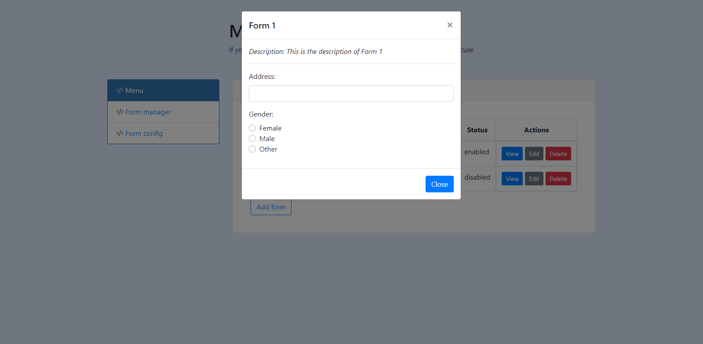

# Formaker - Make things simple!

> Your life is short, but your form type is long!!
> Let us help you save your time with Formaker!

- This product enables users to generate forms quickly and easily, with excellent synchronization, therefore saving time and enhancing quality of life. It can be used in a variety of areas and has a high adaptability on the Internet, numerous online, and mobile platforms.
- The following technologies are used by us:

  - VueJS is a front-end design and programming framework that is contemporary, concise, and easy to use.

  - Java and Spring Boot are two prominent programming languages and frameworks that have been around for a long time.

- Because products are developed in a short period of time, mistakes are unavoidable. In the future, we intend to improve the user interface, introduce more current new features, update more fields, be able to configure fields to a higher degree, import forms from a variety of file kinds, and update the popular form type.

We hope you will find this product useful! Team run0run!

## Demo link: [Formaker](https://hackathon-junctionx.web.app/)

## Demo Youtube video: [Formaker demo video](https://youtu.be/4qQME1js6xU)

## Backend Repo: [Github](https://github.com/minhphong306/junctionx-hackathon)

## UI preview




---

## Project setup

```
npm install
```

```
yarn install
```

### Compiles and hot-reloads for development

```
yarn serve
```

### Compiles and minifies for production

```
yarn build
```

### Lints and fixes files

```
npm run lint
```

### Customize configuration

See [Configuration Reference](https://cli.vuejs.org/config/).
